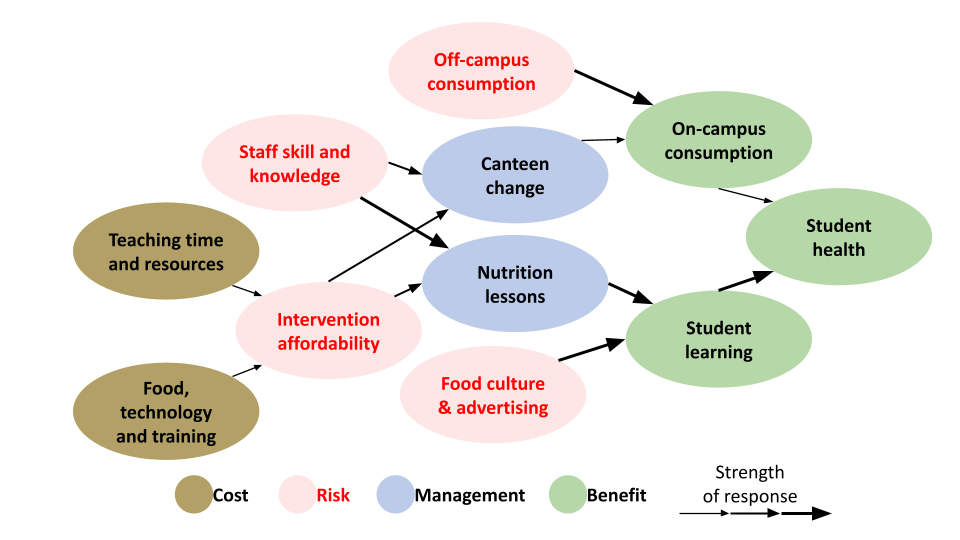

```{r setup, include=FALSE}
knitr::opts_chunk$set(echo = TRUE)
library(stringr)
library(bibtex)
library(dplyr)
```



Here we outline a workflow with algorithmic support in R for comparing our conceptual model to the existing literature corpus, the government policy documents and a qualitative assessment.

We apply this to systematically evaluate whether each component of our conceptual model is supported, refuted, missing from the literature and/or policy documents. We then synthesize this into a shorter, more justified and adjusted version of the model.

We build a semi-automated evidence synthesis framework that treats our documents like a team of virtual reviewers. The core idea is to define the core elements from your simple conceptual model (e.g. canteen regulation, staff training, food safety, nutrition education, etc.), search and summarize what each document says about each element, score the strength and direction of evidence per element, compare and synthesize to get a high-level view of agreement, gaps, and inconsistencies.

## Load Data

```{r load-texts}
# Load .txt files
literature_text <- tolower(readLines("text_Review/Text_Lit_Review.txt"))

policy_text <- tolower(readLines("text_Review/Text_Policy_Review_Eng.txt"))

bib_policy <- read.bib("bib/school_meal_policy.bib")

# Load BibTeX policy entries as plain text
# bib_texts_policy <- tolower(sapply(bib_policy, function(x) paste(x$title, x$abstract, collapse = " ")))

bib_texts_policy <- tolower(sapply(bib_policy, function(x) {
  paste(
    x$title,
    x$abstract,
    if (!is.null(x$annote)) paste(x$annote, collapse = " ") else "",
    collapse = " "
  )
}))


# Load BibTeX literature entries as plain text
bib_literature <- read.bib("bib/school_meal_literature.bib")

# Load BibTeX literature entries as plain text
bib_texts_literature <- tolower(sapply(bib_literature, function(x) {
  paste(
    x$title,
    x$abstract,
    if (!is.null(x$annote)) paste(x$annote, collapse = " ") else "",
    collapse = " "
  )
}))

```

# Define search terms 

## food_tech_training

Infrastructure, equipment, and capacity-building components needed for food preparation and delivery in schools.

```{r food_tech_training}
food_tech_training = c(
  "kitchen equipment", "cooking equipment", "commercial kitchen", 
  "school meal preparation", "technical food support", 
  "canteen operations", "food service logistics", 
  "kitchen operations", "meal service infrastructure", 
  "food production capacity", "food storage infrastructure", 
  "kitchen staff training", "food preparation training", 
  "school catering system", "school meal delivery", 
  "bulk cooking systems", "school kitchen upgrade", 
  "food handling facility", "school feeding infrastructure", "trained and educated on proper nutrition"
)
```

## teaching_resources

Time, personnel, and instructional capacity needed for teachers and staff to implement nutrition interventions.

```{r teaching_resources}

teaching_resources = c(
  "teaching workload", "teacher time", "instructional time", 
  "curricular demands", "lesson planning constraints", 
  "staffing capacity", "teacher availability", 
  "instructional burden", "curriculum overcrowding", 
  "limited teaching time", "staffing shortage", 
  "time allocation", "teaching schedule", 
  "instructional capacity", "non-teaching responsibilities", 
  "classroom time pressure", "teacher deployment", 
  "resource constraints for instruction"
)
```

## staff_skill

The pedagogical and technical competencies of school staff related to nutrition, health, and food safety.

```{r staff_skill}
staff_skill = c(
  "staff nutrition knowledge", "teacher nutrition competency", 
  "school health educators", "teacher skills", 
  "staff training", "training effectiveness", 
  "professional development for teachers", 
  "teacher capacity building", "staff development programs", 
  "food literacy training", "capacity development", 
  "in-service training", "teacher competence", 
  "educator readiness", "pedagogical support for nutrition", 
  "staff preparation", "training coverage", 
  "staff instructional skills", "training quality", 
  "nutrition educator training"
)
```

## intervention_cost

Economic factors influencing the feasibility, sustainability, and scalability of school-based nutrition interventions, including direct costs and systemic financial constraints.

```{r intervention_cost}
intervention_cost = c(
  "intervention cost", "program cost", "implementation cost", 
  "financial feasibility", "budget constraint", "school finance", 
  "economic barrier", "affordability", "funding shortfall", 
  "resource allocation", "cost-effectiveness", "cost-benefit", 
  "financial sustainability", "school budget", "budget limitation", 
  "fiscal capacity", "operational cost", "nutrition program funding", 
  "financial barrier", "economic feasibility", "budget planning", 
  "cost per child", "nutrition intervention expenses"
)
```

## canteen_change

Policy-driven or structural reforms to the school food environment, particularly within canteen services, aimed at improving food quality, nutritional adequacy, and student access to healthy meals.

```{r canteen_change}

canteen_change = c(
  "canteen reform", "school meal change", "menu revision", 
  "canteen intervention", "food service reform", 
  "school food environment", "healthy food provision", 
  "nutrition-sensitive canteen", "school food policy", 
  "canteen nutrition standards", "meal plan reform", 
  "food service update", "school food regulation", 
  "canteen policy enforcement", "nutritional canteen shift", 
  "menu redesign", "food procurement reform", 
  "canteen-based intervention", "school food service management"
)
```

## nutrition_lessons

Educational initiatives and curricular strategies that provide students with knowledge, skills, and attitudes related to nutrition, diet, and healthy lifestyle practices.


```{r nutrition_lessons}

nutrition_lessons = c(
  "nutrition education", "health class", "food literacy lessons", 
  "nutrition curriculum", "classroom food education", 
  "school-based nutrition instruction", "dietary education", 
  "nutrition teaching materials", "health promotion teaching", 
  "lesson on healthy eating", "curriculum-integrated nutrition", 
  "food education", "nutrition behavior curriculum", 
  "classroom nutrition program", "healthy eating curriculum", 
  "nutrition awareness education", "school nutrition module", 
  "teacher-led nutrition instruction", "classroom wellness lesson"
)
```

## food_ads

Advertising and commercial promotion of unhealthy foods in the school environment or within children's media ecosystems that influence eating behaviors and preferences.

```{r food_ads}

food_ads = c(
  "food marketing", "junk food advertising", "unhealthy food ads", 
  "child-targeted food marketing", "ads near school", 
  "commercial food promotion", "branded snack promotion", 
  "advertising to children", "point of sale marketing", 
  "school food advertising", "child-directed advertising", 
  "food and beverage marketing", "media food influence", 
  "food advertisements", "billboard marketing", 
  "TV food commercials", "digital food marketing", 
  "sugar-sweetened beverage marketing", "fast food advertising", 
  "packaging marketing to kids"
)
```

## off_campus

The external food environment accessible to students outside of school grounds, including vendors, markets, and informal sources that often provide low-nutrient, energy-dense foods.

```{r off_campus}
off_campus = c(
  "off-campus eating", "external food", "street food vendors", 
  "gate food", "junk food near school", "mobile food vendors", 
  "non-canteen food", "external food purchases", 
  "school gate vendors", "food from outside school", 
  "unregulated food sales", "open food access", 
  "snack carts near school", "neighborhood food environment", 
  "informal food sources", "out-of-school food access", 
  "off-premises food", "community vendors near school"
)
```

## on_campus

Food consumption and dietary behaviors that occur within school premises, including those influenced by school meals, canteen offerings, and in-school food policies.

```{r on_campus}
on_campus = c(
  "school food consumption", "on-site meal intake", 
  "canteen food intake", "in-school dietary habits", 
  "school-based eating", "healthy eating in school", 
  "school meal participation", "in-school food intake", 
  "on-campus nutrition", "eating during school hours", 
  "classroom snack practices", "canteen-based eating", 
  "student food behavior in school", "regulated food intake", 
  "school food environment behavior", "food consumption at school"
)
```

## student_learning

Academic and cognitive outcomes linked to nutrition and school health environments, including concentration, performance, and educational attainment.


```{r student_learning}

student_learning = c(
  "learning outcomes", "academic performance", "school achievement", 
  "cognitive benefit", "cognitive development", "classroom concentration", 
  "student attention span", "education impact", 
  "student knowledge gain", "test scores", 
  "reading comprehension", "numeracy outcomes", 
  "academic success", "educational attainment", 
  "classroom engagement", "learning readiness", 
  "mental focus", "academic participation", 
  "nutrition and learning", "school-based academic improvement"
)
```

## student_health

Physical health outcomes affected by school food environments, including growth, weight status, illness prevalence, and long-term well-being.


```{r student_health}

student_health = c(
  "child health", "student well-being", "healthy weight", 
  "BMI improvement", "nutritional status", 
  "diet-related health", "physical development", 
  "illness reduction", "health outcome", "childhood obesity", 
  "malnutrition", "nutrition-related disease", 
  "student physical health", "diet quality outcome", 
  "chronic disease prevention", "health behavior", 
  "public health outcome", "body mass index", 
  "school nutrition outcomes", "growth monitoring"
)
```

```{r search_terms_list}
search_terms <- list(
  food_tech_training = food_tech_training,
  teaching_resources = teaching_resources,
  staff_skill = staff_skill,
  intervention_cost = intervention_cost,
  canteen_change = canteen_change,
  nutrition_lessons = nutrition_lessons,
  food_ads = food_ads,
  off_campus = off_campus,
  on_campus = on_campus,
  student_learning = student_learning,
  student_health = student_health
)

```

## Check Text Hits

```{r check-function}
check_hits <- function(search_terms, text) {
  any(sapply(search_terms, function(t) grepl(t, text, ignore.case = TRUE)))
}

comparison_matrix <- data.frame(
  bib_data_policy = sapply(search_terms, check_hits, text = paste(bib_texts_policy, collapse = " ")),
  bib_data_lit = sapply(search_terms, check_hits, text = paste(bib_texts_literature, collapse = " ")),
  gov_review = sapply(search_terms, check_hits, text = paste(policy_text, collapse = " ")),
  lit_review = sapply(search_terms, check_hits, text = paste(literature_text, collapse = " "))
)
```

## Summary Table full model

```{r summary-table}

# Add numeric sum and evidence strength labels
comparison_matrix$support_score <- rowSums(comparison_matrix[ , c("bib_data_policy", "gov_review", "bib_data_lit", "lit_review")])

comparison_matrix$evidence_strength <- cut(
  comparison_matrix$support_score,
  breaks = c(-1, 1, 2, 3, 4.1),
  labels = c("None", "Weak", "Moderate", "Strong"),
  right = TRUE
)
```

```{r table}

# Clean row names
rownames(comparison_matrix) <- gsub("_", " ", rownames(comparison_matrix))
rownames(comparison_matrix) <- stringr::str_to_title(rownames(comparison_matrix))

# Clean column names
colnames(comparison_matrix) <- gsub("_", " ", colnames(comparison_matrix))
colnames(comparison_matrix) <- stringr::str_to_title(colnames(comparison_matrix))


knitr::kable(
  comparison_matrix[, !(names(comparison_matrix) %in% "Support Score")],
  caption = "Model Component Evidence Presence"
)
```


<!-- ```{r long_full_model, child=long_full_model.Rmd} -->
<!-- ``` -->
