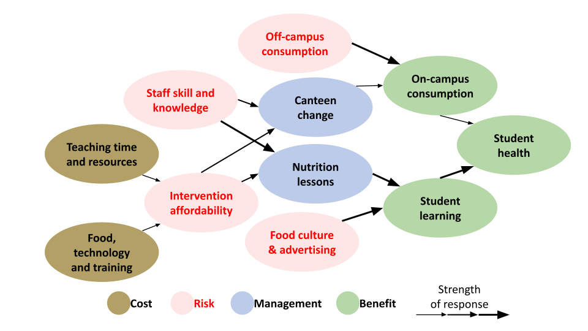
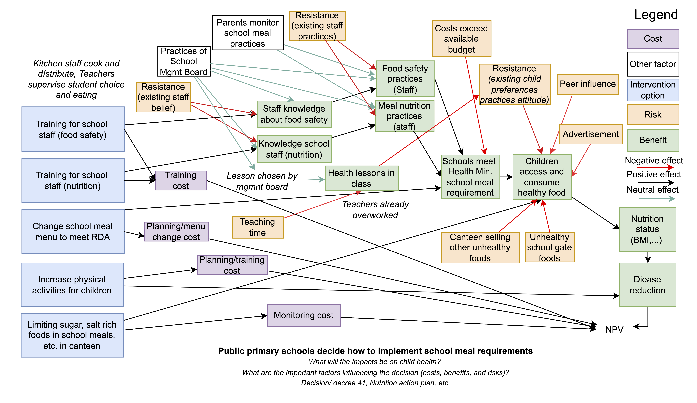

```{r setup, include=FALSE}
knitr::opts_chunk$set(echo = TRUE)
library(stringr)
library(bibtex)
library(dplyr)
library(ggplot2)
library(decisionSupport)
library(dplyr)
library(tidyr)
library(ggplot2)
```

Here we outline a workflow with algorithmic support in R for comparing our conceptual model to the existing literature corpus, the government policy documents and a qualitative assessment. We apply these findings to systematically evaluate whether each component of our conceptual model is supported, refuted, missing from the literature and/or policy documents. We then synthesize this into a justified and adjusted version of the model.

We build a semi-automated evidence synthesis framework that treats our documents like a team of virtual reviewers. The core idea is to define the core elements from our simple conceptual model (e.g. canteen regulation, staff training, food safety, nutrition education, etc.), search and summarize what each document says about each element, score the strength and direction of evidence per element, compare and synthesize to get a high-level view of agreement, gaps, and inconsistencies.

## Decision framing

As a first step we framed the decision of implementing school meal policy. We determined our general understanding of the decision problem in the form of a simple causal model representing the important costs benefits and risks that policy will have at the school level. 


**Figure 1.** Conceptual model of school nutrition policy impacts. The diagram illustrates key variables influencing student health and learning outcomes in the context of school meal interventions. Variables are color-coded by type: management actions (blue) represent components that can be directly modified by policy (e.g. canteen change, nutrition lessons); costs (brown) reflect resource needs for implementation; risks (pink) represent contextual or behavioral barriers such as off-campus consumption or food culture and advertising; and benefits (green) are the desired outcomes, including on-campus consumption, student health, and student learning. Arrows indicate hypothesized causal relationships, with thicker arrows denoting stronger influence.

## Literure and policy review

We performed a review of policy and literature documents and saved the text of the reviews together with the bib files of both the literature and policy review.

```{r load-texts, warning=FALSE}
# Load .txt files
literature_text <- tolower(readLines("text_Review/Text_Lit_Review.txt"))

policy_text <- tolower(readLines("text_Review/Text_Policy_Review_Eng.txt"))

bib_policy <- read.bib("bib/school_meal_policy.bib")

bib_texts_policy <- tolower(sapply(bib_policy, function(x) {
  paste(
    x$title,
    x$abstract,
    if (!is.null(x$annote)) paste(x$annote, collapse = " ") else "",
    collapse = " "
  )
}))

# Load BibTeX literature entries as plain text
bib_literature <- read.bib("bib/school_meal_literature.bib")

# Load BibTeX literature entries as plain text
bib_texts_literature <- tolower(sapply(bib_literature, function(x) {
  paste(
    x$title,
    x$abstract,
    if (!is.null(x$annote)) paste(x$annote, collapse = " ") else "",
    collapse = " "
  )
}))

```

# Algorithmic support

To compare our conceptual model to the existing literature, the government policy documents and our qualitative assessment we search the corpus of each for key terms.

## food_tech_training

Infrastructure, equipment, and capacity-building components needed for food preparation and delivery in schools.

```{r food_tech_training}
food_tech_training = c(
  "kitchen equipment", "cooking equipment", "commercial kitchen", 
  "school meal preparation", "technical food support", 
  "canteen operations", "food service logistics", 
  "kitchen operations", "meal service infrastructure", 
  "food production capacity", "food storage infrastructure", 
  "kitchen staff training", "food preparation training", 
  "school catering system", "school meal delivery", 
  "bulk cooking systems", "school kitchen upgrade", 
  "food handling facility", "school feeding infrastructure", "trained and educated on proper nutrition"
)
```

## teaching_resources

Time, personnel, and instructional capacity needed for teachers and staff to implement nutrition interventions.

```{r teaching_resources}

teaching_resources = c(
  "teaching workload", "teacher time", "instructional time", 
  "curricular demands", "lesson planning constraints", 
  "staffing capacity", "teacher availability", 
  "instructional burden", "curriculum overcrowding", 
  "limited teaching time", "staffing shortage", 
  "time allocation", "teaching schedule", 
  "instructional capacity", "non-teaching responsibilities", 
  "classroom time pressure", "teacher deployment", 
  "resource constraints for instruction"
)
```

## staff_skill

The pedagogical and technical competencies of school staff related to nutrition, health, and food safety.

```{r staff_skill}
staff_skill = c(
  "staff nutrition knowledge", "teacher nutrition competency", 
  "school health educators", "teacher skills", 
  "staff training", "training effectiveness", 
  "professional development for teachers", 
  "teacher capacity building", "staff development programs", 
  "food literacy training", "capacity development", 
  "in-service training", "teacher competence", 
  "educator readiness", "pedagogical support for nutrition", 
  "staff preparation", "training coverage", 
  "staff instructional skills", "training quality", 
  "nutrition educator training"
)
```

## intervention_cost

Economic factors influencing the feasibility, sustainability, and scalability of school-based nutrition interventions, including direct costs and systemic financial constraints.

```{r intervention_cost}
intervention_cost = c(
  "intervention cost", "program cost", "implementation cost", 
  "financial feasibility", "budget constraint", "school finance", 
  "economic barrier", "affordability", "funding shortfall", 
  "resource allocation", "cost-effectiveness", "cost-benefit", 
  "financial sustainability", "school budget", "budget limitation", 
  "fiscal capacity", "operational cost", "nutrition program funding", 
  "financial barrier", "economic feasibility", "budget planning", 
  "cost per child", "nutrition intervention expenses"
)
```

## canteen_change

Policy-driven or structural reforms to the school food environment, particularly within canteen services, aimed at improving food quality, nutritional adequacy, and student access to healthy meals.

```{r canteen_change}

canteen_change = c(
  "canteen reform", "school meal change", "menu revision", 
  "canteen intervention", "food service reform", 
  "school food environment", "healthy food provision", 
  "nutrition-sensitive canteen", "school food policy", 
  "canteen nutrition standards", "meal plan reform", 
  "food service update", "school food regulation", 
  "canteen policy enforcement", "nutritional canteen shift", 
  "menu redesign", "food procurement reform", 
  "canteen-based intervention", "school food service management"
)
```

## nutrition_lessons

Educational initiatives and curricular strategies that provide students with knowledge, skills, and attitudes related to nutrition, diet, and healthy lifestyle practices.

```{r nutrition_lessons}

nutrition_lessons = c(
  "nutrition education", "health class", "food literacy lessons", 
  "nutrition curriculum", "classroom food education", 
  "school-based nutrition instruction", "dietary education", 
  "nutrition teaching materials", "health promotion teaching", 
  "lesson on healthy eating", "curriculum-integrated nutrition", 
  "food education", "nutrition behavior curriculum", 
  "classroom nutrition program", "healthy eating curriculum", 
  "nutrition awareness education", "school nutrition module", 
  "teacher-led nutrition instruction", "classroom wellness lesson"
)
```

## food_ads

Advertising and commercial promotion of unhealthy foods in the school environment or within children's media ecosystems that influence eating behaviors and preferences.

```{r food_ads}

food_ads = c(
  "food marketing", "junk food advertising", "unhealthy food ads", 
  "child-targeted food marketing", "ads near school", 
  "commercial food promotion", "branded snack promotion", 
  "advertising to children", "point of sale marketing", 
  "school food advertising", "child-directed advertising", 
  "food and beverage marketing", "media food influence", 
  "food advertisements", "billboard marketing", 
  "TV food commercials", "digital food marketing", 
  "sugar-sweetened beverage marketing", "fast food advertising", 
  "packaging marketing to kids"
)
```

## off_campus

The external food environment accessible to students outside of school grounds, including vendors, markets, and informal sources that often provide low-nutrient, energy-dense foods.

```{r off_campus}
off_campus = c(
  "off-campus eating", "external food", "street food vendors", 
  "gate food", "junk food near school", "mobile food vendors", 
  "non-canteen food", "external food purchases", 
  "school gate vendors", "food from outside school", 
  "unregulated food sales", "open food access", 
  "snack carts near school", "neighborhood food environment", 
  "informal food sources", "out-of-school food access", 
  "off-premises food", "community vendors near school"
)
```

## on_campus

Food consumption and dietary behaviors that occur within school premises, including those influenced by school meals, canteen offerings, and in-school food policies.

```{r on_campus}
on_campus = c(
  "school food consumption", "on-site meal intake", 
  "canteen food intake", "in-school dietary habits", 
  "school-based eating", "healthy eating in school", 
  "school meal participation", "in-school food intake", 
  "on-campus nutrition", "eating during school hours", 
  "classroom snack practices", "canteen-based eating", 
  "student food behavior in school", "regulated food intake", 
  "school food environment behavior", "food consumption at school"
)
```

## student_learning

Academic and cognitive outcomes linked to nutrition and school health environments, including concentration, performance, and educational attainment.

```{r student_learning}

student_learning = c(
  "learning outcomes", "academic performance", "school achievement", 
  "cognitive benefit", "cognitive development", "classroom concentration", 
  "student attention span", "education impact", 
  "student knowledge gain", "test scores", 
  "reading comprehension", "numeracy outcomes", 
  "academic success", "educational attainment", 
  "classroom engagement", "learning readiness", 
  "mental focus", "academic participation", 
  "nutrition and learning", "school-based academic improvement"
)
```

## student_health

Physical health outcomes affected by school food environments, including growth, weight status, illness prevalence, and long-term well-being.


```{r student_health}

student_health = c(
  "child health", "student well-being", "healthy weight", 
  "BMI improvement", "nutritional status", 
  "diet-related health", "physical development", 
  "illness reduction", "health outcome", "childhood obesity", 
  "malnutrition", "nutrition-related disease", 
  "student physical health", "diet quality outcome", 
  "chronic disease prevention", "health behavior", 
  "public health outcome", "body mass index", 
  "school nutrition outcomes", "growth monitoring"
)
```

```{r search_terms_list}
search_terms <- list(
  food_tech_training = food_tech_training,
  teaching_resources = teaching_resources,
  staff_skill = staff_skill,
  intervention_cost = intervention_cost,
  canteen_change = canteen_change,
  nutrition_lessons = nutrition_lessons,
  food_ads = food_ads,
  off_campus = off_campus,
  on_campus = on_campus,
  student_learning = student_learning,
  student_health = student_health
)

```

## Compare model and reviews

We created a comparison matrix to compare results of the literature and policy review and check whether we can consider them to provide either "Strong", "Moderate", "Weak", or no evidence for our model. 

```{r check-function}
check_hits <- function(search_terms, text) {
  any(sapply(search_terms, function(t) grepl(t, text, ignore.case = TRUE)))
}

comparison_matrix <- data.frame(
  bib_data_policy = sapply(search_terms, check_hits, text = paste(bib_texts_policy, collapse = " ")),
  bib_data_lit = sapply(search_terms, check_hits, text = paste(bib_texts_literature, collapse = " ")),
  gov_review = sapply(search_terms, check_hits, text = paste(policy_text, collapse = " ")),
  lit_review = sapply(search_terms, check_hits, text = paste(literature_text, collapse = " "))
)

# Add numeric sum and evidence strength labels
comparison_matrix$support_score <- rowSums(comparison_matrix[ , c("bib_data_policy", "gov_review", "bib_data_lit", "lit_review")])

comparison_matrix$evidence_strength <- cut(
  comparison_matrix$support_score,
  breaks = c(-1, 0.1, 1.3, 3.1, 4.1),
  labels = c("", "Weak", "Moderate", "Strong"),
  right = TRUE
)

# Clean row names
rownames(comparison_matrix) <- gsub("_", " ", rownames(comparison_matrix))
rownames(comparison_matrix) <- stringr::str_to_title(rownames(comparison_matrix))

# Clean column names
colnames(comparison_matrix) <- gsub("_", " ", colnames(comparison_matrix))
colnames(comparison_matrix) <- stringr::str_to_title(colnames(comparison_matrix))


knitr::kable(
  comparison_matrix[, !(names(comparison_matrix) %in% "Support Score")],
  caption = "Model Component Evidence Presence"
)
```

## Count citations

```{r get_hits_by_bib}
source("functions/get_hits_by_bib.R")
literature_hits <- get_hits_by_bib(search_terms, bib_texts_literature)

policy_hits <- get_hits_by_bib(search_terms, bib_texts_policy)

summary_hits <- data.frame(
  Literature_Count = sapply(literature_hits, length),
  Policy_Count = sapply(policy_hits, length)
)

```

## Policy support for our model 

In policy documents we found mixed support for the variables we expressed in our model:

- `r length(policy_hits$food_tech_training)` referencing **food tech training**.  
  `r if (length(policy_hits$food_tech_training) > 0) paste(paste0("@", policy_hits$food_tech_training), collapse = ", ") else ""`

- `r length(policy_hits$teaching_resources)` referencing **teaching resources**.  
  `r if (length(policy_hits$teaching_resources) > 0) paste(paste0("@", policy_hits$teaching_resources), collapse = ", ") else ""`

- `r length(policy_hits$staff_skill)` referencing **staff skill**.  
  `r if (length(policy_hits$staff_skill) > 0) paste(paste0("@", policy_hits$staff_skill), collapse = ", ") else ""`

- `r length(policy_hits$intervention_cost)` referencing **intervention cost**.  
  `r if (length(policy_hits$intervention_cost) > 0) paste(paste0("@", policy_hits$intervention_cost), collapse = ", ") else ""`

- `r length(policy_hits$canteen_change)` referencing **canteen change**.  
  `r if (length(policy_hits$canteen_change) > 0) paste(paste0("@", policy_hits$canteen_change), collapse = ", ") else ""`

- `r length(policy_hits$nutrition_lessons)` referencing **nutrition lessons**.  
  `r if (length(policy_hits$nutrition_lessons) > 0) paste(paste0("@", policy_hits$nutrition_lessons), collapse = ", ") else ""`

- `r length(policy_hits$food_ads)` referencing **food ads**.  
  `r if (length(policy_hits$food_ads) > 0) paste(paste0("@", policy_hits$food_ads), collapse = ", ") else ""`

- `r length(policy_hits$off_campus)` referencing **off-campus food**.  
  `r if (length(policy_hits$off_campus) > 0) paste(paste0("@", policy_hits$off_campus), collapse = ", ") else ""`

- `r length(policy_hits$on_campus)` referencing **on-campus food**.  
  `r if (length(policy_hits$on_campus) > 0) paste(paste0("@", policy_hits$on_campus), collapse = ", ") else ""`

- `r length(policy_hits$student_learning)` referencing **student learning**.  
  `r if (length(policy_hits$student_learning) > 0) paste(paste0("@", policy_hits$student_learning), collapse = ", ") else ""`

- `r length(policy_hits$student_health)` referencing **student health**.  
  `r if (length(policy_hits$student_health) > 0) paste(paste0("@", policy_hits$student_health), collapse = ", ") else ""`


## Literature support for our model 

In the literature we found supporting evidence for the variables we expressed in our model:

- `r length(literature_hits$food_tech_training)` referencing **food tech training**.  
  `r if (length(literature_hits$food_tech_training) > 0) paste(paste0("@", literature_hits$food_tech_training), collapse = ", ") else ""`

- `r length(literature_hits$teaching_resources)` referencing **teaching resources**.  
  `r if (length(literature_hits$teaching_resources) > 0) paste(paste0("@", literature_hits$teaching_resources), collapse = ", ") else ""`

- `r length(literature_hits$staff_skill)` referencing **staff skill**.  
  `r if (length(literature_hits$staff_skill) > 0) paste(paste0("@", literature_hits$staff_skill), collapse = ", ") else ""`

- `r length(literature_hits$intervention_cost)` referencing **intervention cost**.  
  `r if (length(literature_hits$intervention_cost) > 0) paste(paste0("@", literature_hits$intervention_cost), collapse = ", ") else ""`

- `r length(literature_hits$canteen_change)` referencing **canteen change**.  
  `r if (length(literature_hits$canteen_change) > 0) paste(paste0("@", literature_hits$canteen_change), collapse = ", ") else ""`

- `r length(literature_hits$nutrition_lessons)` referencing **nutrition lessons**.  
  `r if (length(literature_hits$nutrition_lessons) > 0) paste(paste0("@", literature_hits$nutrition_lessons), collapse = ", ") else ""`

- `r length(literature_hits$food_ads)` referencing **food ads**.  
  `r if (length(literature_hits$food_ads) > 0) paste(paste0("@", literature_hits$food_ads), collapse = ", ") else ""`

- `r length(literature_hits$off_campus)` referencing **off-campus food**.  
  `r if (length(literature_hits$off_campus) > 0) paste(paste0("@", literature_hits$off_campus), collapse = ", ") else ""`

- `r length(literature_hits$on_campus)` referencing **on-campus food**.  
  `r if (length(literature_hits$on_campus) > 0) paste(paste0("@", literature_hits$on_campus), collapse = ", ") else ""`

- `r length(literature_hits$student_learning)` referencing **student learning**.  
  `r if (length(literature_hits$student_learning) > 0) paste(paste0("@", literature_hits$student_learning), collapse = ", ") else ""`

- `r length(literature_hits$student_health)` referencing **student health**.  
  `r if (length(literature_hits$student_health) > 0) paste(paste0("@", literature_hits$student_health), collapse = ", ") else ""`

# Model update and Monte Carlo Simulation

We took all these findings into account and also talked to experts to update the model. 


We ran the full model using Monte Carlo simulation to estimate the likely outcomes of different school nutrition policy configurations. All uncertain inputs were defined using probability distributions (e.g. truncated normal, beta, or uniform). Policy toggles, such as staff training and canteen monitoring, were included as binary variables with a 50% probability to simulate diverse configurations. This allowed exploration of combined and independent effects of policy elements.

## Key Input Assumptions

All model inputs were modeled probabilistically based on expert judgment and literature estimates. See the input file `inputs_school_policy.csv` for full details.

The outputs include both health cost savings (e.g. avoided diagnoses and treatments) and economic return (net present value compared to the baseline). These are plotted below to visualize the decision space.

The three outcomes tracked were, Economic Return (Net Present Value of policy vs. no policy), Health Cost Savings (avoided treatment and diagnosis costs), Cost per Student (total implementation cost per student). 

```{r monte_carlo, warning=FALSE}

source("functions/school_policy_function.R")
# Load inputs and run simulation
input_data <- estimate_read_csv("data/inputs_school_policy.csv")

numberOfModelRuns <- 10000

set.seed(84)
simulation_result <- mcSimulation(
  estimate = input_data,
  model_function = school_policy_function,
  numberOfModelRuns = numberOfModelRuns,
  functionSyntax = "plainNames"
)

```

We used a Monte Carlo simulation to estimate the economic and health outcomes of school meal policy interventions under uncertainty. We ran the model `r sum(numberOfModelRuns)` times to capture uncertainty across a wide range of possible scenarios. The results show that school policy interventions can offer both cost savings and improved student health. The model includes toggle variables to simulate the presence or absence of specific interventions, allowing us to identify which combinations of actions appear in the most efficient scenarios.

# Pareto analysis

The Pareto front includes simulations that are not outperformed in all objectives by any other scenario. These are the most efficient configurations—improvements in one outcome would require trade-offs in others.

We then performed a multi-objective Pareto analysis across three dimensions: economic return (NPV), health cost savings, and cost per student.

The resulting Pareto front reveals a clear trade-off curve. Policy configurations that maximize economic return do not necessarily maximize health benefits or minimize per-student costs. Conversely, policies with strong health outcomes can come at higher per-student costs or lower net present values.

These findings highlight the existence of efficient policy options that cannot be improved in one objective without sacrificing another. Decision-makers can use this front to choose policies based on priorities — e.g., maximizing health benefits under a fixed cost constraint, or seeking the best ROI with acceptable health impacts.

```{r}

sim_data <- data.frame(simulation_result$x, simulation_result$y[1:3])  # Extract all output values

# Extended Pareto filter for 3D (non-dominated solutions across 3 objectives)
pareto_filter_3d <- function(df, obj1, obj2, obj3) {
  pareto <- rep(TRUE, nrow(df))
  for (i in 1:nrow(df)) {
    pareto[i] <- !any(
      df[[obj1]] > df[[obj1]][i] &
      df[[obj2]] >= df[[obj2]][i] &
      df[[obj3]] >= df[[obj3]][i] |
      df[[obj1]] >= df[[obj1]][i] &
      df[[obj2]] > df[[obj2]][i] &
      df[[obj3]] >= df[[obj3]][i] |
      df[[obj1]] >= df[[obj1]][i] &
      df[[obj2]] >= df[[obj2]][i] &
      df[[obj3]] > df[[obj3]][i]
    )
  }
  return(df[pareto, ])
}

# Prepare full data 
sim_data <- data.frame(simulation_result$x, simulation_result$y[, c("decision_value", "health_cost_savings", "cost_per_student")])

# Get Pareto front
pareto_3d <- pareto_filter_3d(sim_data, "decision_value", "health_cost_savings", "cost_per_student")

# Combine flag to indicate Pareto-optimal points
sim_data$on_pareto <- apply(sim_data[, c("decision_value", "health_cost_savings", "cost_per_student")], 1, function(pt) {
  any(apply(pareto_3d[, c("decision_value", "health_cost_savings", "cost_per_student")], 1, function(pf) all(pt == pf)))
})

# Summarize means of input variables
input_vars <- setdiff(colnames(simulation_result$x), c("decision_value", "health_cost_savings", "cost_per_student"))

```

## Plot Pareto optimal 

```{r}
# Add Pareto label
sim_data$Pareto <- ifelse(sim_data$on_pareto, "Pareto", "Other")

# Create long format for all 3 outcomes
pairwise_data <- bind_rows(
  sim_data %>% select(x = decision_value, y = health_cost_savings, Pareto) %>% mutate(Pair = "NPV vs Health"),
  sim_data %>% select(x = decision_value, y = cost_per_student, Pareto) %>% mutate(Pair = "NPV vs Cost/Student"),
  sim_data %>% select(x = health_cost_savings, y = cost_per_student, Pareto) %>% mutate(Pair = "Health vs Cost/Student")
)


# Rename columns for readability
plot_data <- sim_data %>%
  dplyr::rename(
    Economic = decision_value,
    Health = health_cost_savings,
    CostPerStudent = cost_per_student
  )

# Define color palette
pareto_colors <- c("Other" = "gray", "Pareto" = "red")

# Individual plots
p1 <- ggplot(plot_data, aes(x = Economic, y = Health, color = Pareto)) +
  geom_point(size = 1.5, alpha = 0.6) +
  scale_color_manual(values = pareto_colors) +
  labs(x = "Economic (million VND)", y = "Health (million VND)") +
  theme_minimal(base_size = 12) +
    theme(
    legend.position = "none",
    axis.text.x = element_blank(),
    axis.ticks.x = element_blank(),
    axis.title.x = element_blank()
  )

p2 <- ggplot(plot_data, aes(x = Economic, y = CostPerStudent, color = Pareto)) +
  geom_point(size = 1.5, alpha = 0.6) +
  scale_color_manual(values = pareto_colors) +
  labs(x = "Economic (million VND)", y = "Cost per Student (million VND)") +
  theme_minimal(base_size = 12) +
  theme(legend.position = "none")

p3 <- ggplot(plot_data, aes(x = Health, y = CostPerStudent, color = Pareto)) +
  geom_point(size = 1.5, alpha = 0.6) +
  scale_color_manual(values = pareto_colors) +
  labs(x = "Health (million VND)", y = "Cost per Student (million VND)") +
  theme_minimal(base_size = 12) +
  theme(
    legend.position = "none",
    axis.text.y = element_blank(),
    axis.ticks.y = element_blank(),
    axis.title.y = element_blank()
  )

# Shared legend
legend <- cowplot::get_legend(
  p1 + theme(legend.position = "right", legend.title = element_blank())
)

# Arrange as a 2x2 panel (bottom-left = NPV vs Health)
final_plot <- cowplot::plot_grid(
  p1, legend,
  p2, p3,
  ncol = 2, rel_widths = c(1, 1)
)

final_plot

ggsave("figures/Fig_Pareto.png", final_plot, width = 10, height = 7)
```

**Figure 2.** Pairwise comparison of policy outcomes. Each point is a simulation result. Red dots indicate simulations on the Pareto frontier (non-dominated). Panels show trade-offs between Economic Return, Health, and Cost per Student.

While outcomes vary, a subset of efficient policy configurations emerged that balance return on investment, health improvements, and implementation cost.

To better understand what drives the most efficient outcomes, we compared the input variables for simulations on the Pareto frontier (non-dominated in terms of return, health impact, and cost) to those across all simulations.

We compared the mean values of all input variables between the full simulation set and the Pareto-optimal subset. The variables with the greatest deviations help identify factors that characterize efficient policy configurations.

The column `Mean_Pareto` shows the average value of each input among simulations on the Pareto front. `Mean_All` shows the average across the full set of model runs. The difference is summarized in `Change_Pareto_vs_All`. It is the percent change from the average in the full dataset to the average in Pareto-optimal cases. Positive values mean the variable was higher on average in efficient cases, suggesting it's associated with good performance.

```{r}

summary_table <- data.frame(
  Mean_All = sapply(simulation_result$x[, input_vars], mean),
  Mean_Pareto = sapply(sim_data[sim_data$on_pareto, input_vars], mean)
)

# Calculate relative difference
summary_table$Change_Pareto_vs_All <- (summary_table$Mean_Pareto - summary_table$Mean_All) / summary_table$Mean_All * 100

# Only the Pareto-optimal subset (those not dominated on all three outcome axes: NPV, health, cost).

summary_table <- summary_table[order(-abs(summary_table$Change_Pareto_vs_All)), ]
knitr::kable(summary_table, digits = 2, caption = "Input Trends in Pareto-Optimal Simulations")

```

These top values indicate that Pareto-optimal simulations tend to have much higher nutrition training investments (suggesting this is a key lever for success), higher cost per diagnosis, which may allow more room for cost savings through prevention, more diagnoses prevented, showing effective health outcomes.

Higher spending on staff training — especially for nutrition — appears more often in efficient policy configurations. These costs are higher in Pareto-optimal simulations, suggesting such investments may lead to better economic and health returns.

Many Pareto-optimal scenarios involved combined interventions (e.g., both staff training and menu changes). This suggests that integrated policies—rather than isolated measures—may yield the most efficient outcomes.

Diagnosis cost and reduction in diagnoses are both elevated in the Pareto front. This might reflect scenarios where interventions successfully reduce high-cost health events — meaning more expensive health systems create more room for cost-saving.

Budget exceedance is also slightly higher in Pareto cases. This may reflect that some effective strategies come close to or slightly over budget thresholds but still offer worthwhile returns.

## Interpretation caveats

While the Monte Carlo simulation and Pareto analysis identify policy scenarios with favorable outcomes, we found that many input variables exerted weak or inconsistent influence across runs. Only a small number of parameters—such as the number of students, cost of diagnosis, and staff training investments—appeared consistently influential in efficient scenarios.

This suggests that model results are sensitive to the scale of implementation (e.g. school size) and a few high-leverage parameters. Other inputs had relatively limited or noisy influence on results. This highlights the importance of careful parameter validation and the need for further expert engagement or empirical data to refine key estimates.

Overall, this simple model provides a transparent structure for exploring trade-offs, and the number of students emerges as the key scaling driver of outcome magnitude. Future work should prioritize narrowing uncertainty around critical parameters like student population, cost scaling, and implementation efficiency.

This analysis provides insight into how specific school nutrition policy components influence multiple objectives under uncertainty. The approach demonstrates how evidence-based modeling can inform practical decision-making, supporting the design of more effective and efficient interventions.

# References

