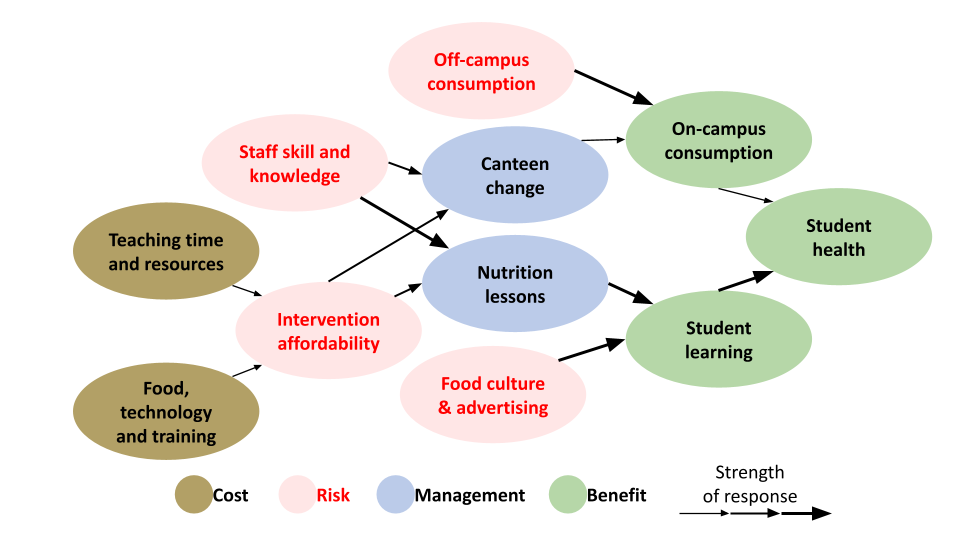
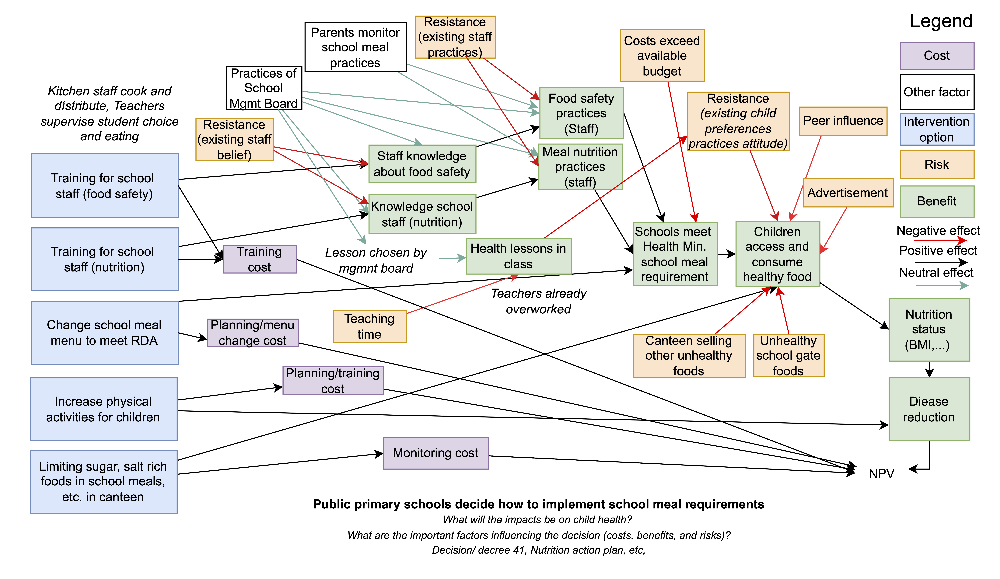

```{r setup, include=FALSE}
knitr::opts_chunk$set(echo = TRUE)
library(stringr)
library(bibtex)
library(dplyr)
library(ggplot2)
library(decisionSupport)
library(dplyr)
library(tidyr)
library(ggplot2)

knitr::write_bib(c(.packages(),
                   "bibtex",
                   "cowplot",
                   "decisionSupport",
                   "dplyr",
                   "ggplot2",
                   "knitr",
                   "scales",
                   "stringr",
                   "tidyr"), file = "bib/model_packages.bib")

```

# Decision Context and Conceptual Framework

This analysis is designed to support decision-makers in school nutrition policy. These decision makers include education ministries, school administrators, and public health agencies. The objective of the analysis is to give scientific support to their decision by evaluating the school-level impacts of nutrition policy interventions. 

We built a Monte Carlo simulation to quantify trade-offs across 10,000 policy configurations, identifying Pareto-optimal strategies that balance economic, health, and educational outcomes. Our workflow bridges conceptual validation (via automated literature/policy alignment checks) and quantitative prioritization, ensuring interventions are both evidence-based and operationally feasible.

The model described here explicitly links actionable policy levers (canteen reforms, staff training, nutrition education) to outcomes (student health, learning, cost-efficiency), as visualized in Figure 1. Grounded in literature and policy evidence (validated in Tables 1–2), we focus on five core intervention domains (used as intervention domains in our model):

- Food Safety Training
- Nutrition Training	
- Physical Activity	
- Menu Change to Meet RDA	
- Limit Unhealthy Canteen Food	

## Decision framing

As a first step we framed the decision of implementing school meal policy. We determined our general understanding of the decision problem in the form of a simple causal model representing the important costs benefits and risks that the five intervention domains will have at the school level. 


**Figure 1.** Conceptual model of school nutrition policy impacts. The diagram illustrates key variables influencing student health and learning outcomes in the context of school meal interventions. Variables are color-coded by type: management actions (blue) represent components that can be directly modified by policy (e.g. canteen change, nutrition lessons); costs (brown) reflect resource needs for implementation; risks (pink) represent contextual or behavioral barriers such as off-campus consumption or food culture and advertising; and benefits (green) are the desired outcomes, including on-campus consumption, student health, and student learning. Arrows indicate hypothesized causal relationships, with thicker arrows denoting stronger influence.

## Literature and policy review

We apply algorithmic support in R for comparing our conceptual model to the existing literature corpus, government policy documents and a qualitative assessment, using the `stringr` [@R-stringr] and `bibtex` [@R-bibtex] packages for text processing and bibliography parsing. We apply these findings to systematically evaluate whether each component of our conceptual model is supported, refuted, missing from the literature and/or policy documents. We then synthesize this into a justified and adjusted version of the model (see [Literature and Policy Review for Nutrition interventions in Hanoi Schools]( https://htmlpreview.github.io/?https://github.com/kimanh358/HUPH_decision_policy_nutrition/blob/main/lit_review.html)).

# Model update and Monte Carlo Simulation

We took all literatture and policy review findings into account and also talked to experts to update the model. 


We ran the full model using Monte Carlo simulation to estimate the likely outcomes of different school nutrition policy configurations. All uncertain inputs were defined using probability distributions (e.g. truncated normal, normal, or uniform). Policy toggles, such as staff training and canteen monitoring, were included as binary variables with a 50% probability (10 to 90% chance of occurrence) to simulate diverse configurations. This allowed exploration of combined and independent effects of policy elements.

## Key Input Assumptions

All model inputs were modeled probabilistically based on expert judgment and literature estimates. See the script `school_policy_function.R` and input file `input_school_policy_post.csv` for full details.

```{r monte_carlo, warning=FALSE, echo=FALSE}

source("functions/school_policy_function.R")
# Load inputs and run simulation
input_data <- estimate_read_csv("data/input_school_policy_post.csv")

numberOfModelRuns <- 10000

set.seed(84) #VN country code
simulation_result <- mcSimulation(
  estimate = input_data,
  model_function = school_policy_function,
  numberOfModelRuns = numberOfModelRuns,
  functionSyntax = "plainNames"
)

```

We used a Monte Carlo simulation [@R-decisionSupport] to estimate the educational and health outcomes of school meal policy interventions. We ran the model 10,000 times to capture uncertainty across a wide range of possible scenarios. 

## Comparative outcome distributions

We compare the distributions of the three discounted outcome variables directly. The Decision NPV integrates both health savings and education gains net of costs, while Net Health Benefit and Education Benefit represent the component contributions before estimating costs.

```{r npv_comparative_distributions, warning=FALSE, echo=FALSE}

npv_comparative_distributions <- plot_distributions(mcSimulation_object = simulation_result, 
                   vars = c("decision_value", "net_health_benefit", "education_benefit"), method = "boxplot", x_axis_name = "Million VND over 5 years", 
                             old = c("decision_value", "net_health_benefit", "education_benefit"),
                   new_names = c("Overall Decision NPV", "Net Health Benefit", "Education Benefit"))

npv_comparative_distributions

ggsave("figures/npv_comparative_distributions.png", npv_comparative_distributions, width = 10, height = 7)

```

## Cashflow over the policy horizon

The plots below show how each outcome component accumulates year by year across all 10,000 simulations. The shaded band spans the 5th–95th percentile; the solid line is the median. Because `cashflow_policy` is the incremental cashflow (policy minus do-nothing), its median discounts to `decision_value`. `cashflow_health` and `cashflow_education` are the two additive benefit components before subtracting implementation costs.

```{r cashflow_plots, warning=FALSE, echo=FALSE, fig.height=9, fig.width=10}
library(cowplot)

cf_policy <- decisionSupport::plot_cashflow(
  mcSimulation_object = simulation_result,
  cashflow_var_name    = "cashflow_policy",
  x_axis_name         = "Year",
  y_axis_name         = "Million VND",
  color_25_75         = "steelblue",
  color_5_95          = "lightsteelblue",
  base_size           = 10
) +
  ggplot2::labs(title = "Incremental decision cashflow (policy minus do-nothing)") +
  ggplot2::geom_hline(yintercept = 0, linetype = "dashed", colour = "grey50")

cf_health <- decisionSupport::plot_cashflow(
  mcSimulation_object = simulation_result,
  cashflow_var_name    = "cashflow_health",
  x_axis_name         = "Year",
  y_axis_name         = "Million VND",
  color_25_75         = "palegreen3",
  color_5_95          = "palegreen",
  base_size           = 10
) +
  ggplot2::labs(title = "Net health benefit") +
  ggplot2::geom_hline(yintercept = 0, linetype = "dashed", colour = "grey50")

cf_education <- decisionSupport::plot_cashflow(
  mcSimulation_object = simulation_result,
  cashflow_var_name    = "cashflow_education",
  x_axis_name         = "Year",
  y_axis_name         = "Million VND",
  color_25_75         = "salmon",
  color_5_95          = "mistyrose",
  base_size           = 10
) +
  ggplot2::labs(title = "Education benefit") +
  ggplot2::geom_hline(yintercept = 0, linetype = "dashed", colour = "grey50")

cashflow_composite <- cowplot::plot_grid(
  cf_policy,
  cf_health,
  cf_education,
  ncol        = 1,
  align       = "v",
  axis        = "lr",
  rel_heights = c(1, 1, 1)
)

cashflow_composite

ggsave("figures/cashflow_composite.png", cashflow_composite, width = 10, height = 9)

```

**Figure 3.** Year-by-year cashflows over the 5-year policy horizon. Each panel shows 10,000 simulation trajectories; shaded bands span the 5th–95th (outer) and 25th–75th (inner) percentile range; the solid line is the median. **Top:** incremental decision cashflow — the net gain of acting versus doing nothing, inclusive of all implementation costs. **Middle:** net health benefit (reduced diagnosis and treatment costs plus absenteeism savings). **Bottom:** education benefit (incremental learning value attributable to the intervention). The health and education panels sum to the gross policy benefit; subtracting implementation costs gives the top panel. Plots produced with `ggplot2` [@R-ggplot2] and composited with `cowplot` [@R-cowplot].

## Distribution of NPV components by intervention

Each row is one intervention (active runs only). The three columns show the distribution of the **overall net** NPV, the **health** component, and the **education** component across all Monte Carlo runs. Visualised with `ggplot2` [@R-ggplot2] and arranged with `cowplot` [@R-cowplot]. 

```{r npv_components_by_intervention, warning=FALSE, echo=FALSE, fig.height=18, fig.width=11}
library(cowplot)

toggle_vars <- c(
  "use_staff_training_foodsafety",
  "use_staff_training_nutrition",
  "use_physical_activity",
  "use_menu_change_rda",
  "use_limit_unhealthy_canteen_food"
)

toggle_labels <- c(
  "Food Safety Training",
  "Nutrition Training",
  "Physical Activity",
  "Menu Change to RDA",
  "Limit Unhealthy Canteen Food"
)

colours_dark  <- c("salmon",    "sandybrown", "palegreen3", "skyblue",  "mediumpurple2")
colours_light <- c("mistyrose", "moccasin",   "palegreen",  "aliceblue","lavender")

col_titles <- cowplot::plot_grid(
  cowplot::ggdraw() + cowplot::draw_label("Overall (net)",     fontface = "bold", size = 11),
  cowplot::ggdraw() + cowplot::draw_label("Health benefit",    fontface = "bold", size = 11),
  cowplot::ggdraw() + cowplot::draw_label("Education benefit", fontface = "bold", size = 11),
  ncol = 3
)

make_box <- function(values, dark_col, light_col, y_label = "Million VND",
                     ylim = NULL, show_y = TRUE) {
  df <- data.frame(x = " ", y = values)
  p <- ggplot2::ggplot(df, ggplot2::aes(x = x, y = y)) +
    ggplot2::geom_boxplot(
      fill = light_col, colour = dark_col, linewidth = 0.6,
      outlier.shape = NA,
      coef = 0  # whiskers at 25/75 box edges; we draw 5/95 manually below
    ) +
    ggplot2::stat_boxplot(
      geom = "errorbar", width = 0.25, colour = dark_col,
      coef = (quantile(values, 0.95, na.rm = TRUE) - median(values, na.rm = TRUE)) /
              (diff(range(values, na.rm = TRUE)) * 0.01 + 1e-9)
    ) +
    ggplot2::geom_segment(
      ggplot2::aes(x = 0.75, xend = 1.25,
                   y = quantile(values, 0.05, na.rm = TRUE),
                   yend = quantile(values, 0.05, na.rm = TRUE)),
      colour = dark_col, linewidth = 0.5, linetype = "dashed"
    ) +
    ggplot2::geom_segment(
      ggplot2::aes(x = 0.75, xend = 1.25,
                   y = quantile(values, 0.95, na.rm = TRUE),
                   yend = quantile(values, 0.95, na.rm = TRUE)),
      colour = dark_col, linewidth = 0.5, linetype = "dashed"
    ) +
    ggplot2::geom_hline(yintercept = 0, linetype = "dashed", colour = "grey50") +
    ggplot2::labs(x = NULL, y = if (show_y) y_label else NULL) +
    ggplot2::theme_minimal(base_size = 9) +
    ggplot2::theme(axis.text.x = ggplot2::element_blank(),
                   axis.ticks.x = ggplot2::element_blank())
  if (!is.null(ylim))
    p <- p + ggplot2::coord_cartesian(ylim = ylim)
  if (!show_y)
    p <- p + ggplot2::theme(axis.text.y  = ggplot2::element_blank(),
                             axis.ticks.y = ggplot2::element_blank())
  p
}

# Compute shared y-limits per column across all five interventions
col_data <- lapply(toggle_vars, function(v) {
  on <- simulation_result$x[[v]] >= 0.5
  sy <- simulation_result$y[on, , drop = FALSE]
  list(decision   = sy$decision_value,
       health     = sy$net_health_benefit,
       education  = sy$education_benefit)
})
ylim_decision  <- range(unlist(lapply(col_data, `[[`, "decision")),  na.rm = TRUE)
ylim_health    <- range(unlist(lapply(col_data, `[[`, "health")),    na.rm = TRUE)
ylim_education <- range(unlist(lapply(col_data, `[[`, "education")), na.rm = TRUE)

row_plots <- lapply(seq_along(toggle_vars), function(i) {
  v   <- toggle_vars[i]
  on  <- simulation_result$x[[v]] >= 0.5
  sy  <- simulation_result$y[on, , drop = FALSE]

  row_label <- cowplot::ggdraw() +
    cowplot::draw_label(toggle_labels[i], angle = 90, fontface = "bold", size = 10)

  content <- cowplot::plot_grid(
    make_box(sy$decision_value,     colours_dark[i], colours_light[i],
             ylim = ylim_decision,  show_y = TRUE),
    make_box(sy$net_health_benefit, colours_dark[i], colours_light[i],
             ylim = ylim_health,    show_y = FALSE),
    make_box(sy$education_benefit,  colours_dark[i], colours_light[i],
             ylim = ylim_education, show_y = FALSE),
    ncol = 3, align = "h"
  )

  cowplot::plot_grid(row_label, content, ncol = 2, rel_widths = c(0.08, 1))
})

npv_components_by_intervention <- cowplot::plot_grid(
  col_titles,
  cowplot::plot_grid(plotlist = row_plots, ncol = 1, align = "v"),
  ncol = 1, rel_heights = c(0.04, 1)
)

npv_components_by_intervention

ggsave("figures/npv_components_by_intervention.png", npv_components_by_intervention, width = 10, height = 7)

```

Overall our simulations show that implementation of the policy will have a positive effect on health and education. 

# Comparing five actions

Next we look for formulations of school meal interventions that show the greatest influence on overall, health and education outcomes. Our model includes toggle variables to simulate the presence or absence of specific interventions. We can identify which combinations of actions appear in the most efficient scenarios.

## Mean decision value by action

We compare the mean net present value (NPV) of the policy decision across simulations where each intervention was present (toggle = 1) versus absent (toggle = 0). 

```{r toggle_mean_table, echo=FALSE}
toggle_vars <- c(
  "use_staff_training_foodsafety",
  "use_staff_training_nutrition",
  "use_physical_activity",
  "use_menu_change_rda",
  "use_limit_unhealthy_canteen_food"
)

toggle_labels <- c(
  "Food Safety Training",
  "Nutrition Training",
  "Physical Activity",
  "Menu Change to Meet RDA",
  "Limit Unhealthy Canteen Food"
)

sim_x <- simulation_result$x
decision_value <- simulation_result$y$decision_value

toggle_comparison <- do.call(rbind, lapply(seq_along(toggle_vars), function(i) {
  v <- toggle_vars[i]
  fired <- sim_x[[v]] >= 0.5
  data.frame(
    Intervention = toggle_labels[i],
    Mean_NPV_off = mean(decision_value[!fired]),
    Mean_NPV_on  = mean(decision_value[fired]),
    Difference   = mean(decision_value[fired]) - mean(decision_value[!fired])
  )
}))

knitr::kable(toggle_comparison, digits = 0,
             col.names = c("Intervention", "Mean NPV (off)", "Mean NPV (on)", "Difference"),
             caption = "Mean decision NPV (million VND) by intervention toggle")
```


## Expected Value of Perfect Information (EVPI) analysis

Run Expected Value of Perfect Information (EVPI) analysis and save the result as `data_evpi.Rda`. We run `multi_EVPI` on the full input space `simulation_result$x` rather than just the toggles — the important uncertainty is in the effect-magnitude and cost parameters, not in whether each intervention is "on." 

```{r run_all_evpi, echo=FALSE}
# Select decision variables
# mcSimulation_table <- data.frame(simulation_result$x, simulation_result$y[1:3])
# Run multi_evpi
# EVPI <- multi_EVPI(mc = mcSimulation_table, first_out_var = "decision_value")
# Save as a local .Rda
# save(EVPI,file="data/data_evpi.Rda")
 load("data/data_evpi.Rda") # open from saved file (last model run) - it is stable result / takes very long to run
```

The EVPI analysis quantifies the maximum expected benefit of resolving uncertainty
before committing to a decision. According to the EVPI there is value in gathering further information to better inform decision making.

```{r sum_evpi, echo=FALSE}
# "decision_value", "net_health_benefit", "education_benefit"
sum(EVPI$decision_value$EVPI_do, na.rm = T) 
sum(EVPI$net_health_benefit$EVPI_do, na.rm = T) 
sum(EVPI$education_benefit$EVPI_do, na.rm = T) 
```

For **net health benefits**, the EVPI is
`r round(sum(EVPI$net_health_benefit$EVPI_do, na.rm = TRUE), 3)`; for **education benefits**, the EVPI is
`r round(sum(EVPI$education_benefit$EVPI_do, na.rm = TRUE), 4)`; for the **composite decision value** (NPV), the EVPI is
`r round(sum(EVPI$decision_value$EVPI_do, na.rm = TRUE), 2)` million VND. A small residual uncertainty in the return in a minority of simulations produce
outcomes close to break-even, and perfect information about those parameters could
marginally improve the decision. Nevertheless, the magnitude is low relative to the
median NPV, and the decision to implement remains robust. Together, these results
suggest that further data collection is unlikely to change the policy recommendation,
and the current evidence base is sufficient to proceed with the intervention.

# School-level expert health effect assessment

During expert elicitation, staff at each of the three study schools provided their own estimates, including student numbers, training costs, food environment conditions, BMI prevalence, and barriers to implementation. 

To keep the health effect estimates internally consistent and comparable across schools, we retain the general pooled health parameters from `input_school_policy_post.csv` (disease diagnosis and treatment rates, cost per event, sick-day parameters). The school-specific contextual and cost variables are overlaid on top of this base, so each school's simulation reflects its own food environment and operational costs while sharing a common health parameter set.

We run the full `school_policy_function` as a separate Monte Carlo for each school (5,000 runs), producing school-specific distributions of the net health benefit and showing the relative contribution of each of the five management options.

```{r school_expert_mc, warning=FALSE, echo=FALSE, message=FALSE}

school_files <- c(
  "Dong Ngac A" = "data/three_schools_data/input_school_policy_Dongngac.csv",
  "Dong Ngac B" = "data/three_schools_data/input_school_policy_DongngacB.csv",
  "Duc Thang"   = "data/three_schools_data/input_school_policy_Duc_Thang.csv"
)

# Health variables: always taken from the pooled general estimates
health_vars <- c(
  "disease_diagnosis_cost",    "disease_treatment_cost",
  "n_reduce_disease_diagnosis","n_reduce_disease_treatment",
  "baseline_disease_diagnosis","baseline_disease_treatment",
  "baseline_sick_days_per_student","n_sick_days_avoided_per_student",
  "value_per_sick_day_lost"
)

base_df <- read.csv("data/input_school_policy_post.csv",
                    stringsAsFactors = FALSE)

# Build a merged estimate: start from base, overwrite school-specific rows
# (those that exist in base, are not health vars, and are not blank separators)
build_school_estimate <- function(school_csv_path) {
  school_df <- read.csv(school_csv_path, stringsAsFactors = FALSE)
  override  <- !is.na(school_df$variable) &
               school_df$variable != "" &
               school_df$variable %in% base_df$variable &
               !school_df$variable %in% health_vars
  merged <- base_df
  for (v in school_df$variable[override]) {
    merged[merged$variable == v, ] <- school_df[school_df$variable == v, ]
  }
  # Keep only real variable rows (strip blank separators and NA rows).
  # Use write.table with quote=FALSE and na="" so the temp CSV matches the
  # original format: unquoted headers, empty strings for missing medians.
  # write.csv would write NA for empty medians and quote all strings, both of
  # which cause estimate_read_csv to drop variables after the first NA row.
  merged <- merged[!is.na(merged$variable) & trimws(merged$variable) != "", ]
  tmp <- tempfile(fileext = ".csv")
  write.table(merged, tmp, sep = ",", row.names = FALSE, quote = FALSE, na = "")
  estimate_read_csv(tmp)
}

toggle_vars <- c(
  "use_staff_training_foodsafety",
  "use_staff_training_nutrition",
  "use_physical_activity",
  "use_menu_change_rda",
  "use_limit_unhealthy_canteen_food"
)

toggle_labels <- c(
  "Food Safety\nTraining",
  "Nutrition\nTraining",
  "Physical\nActivity",
  "Menu Change\nto RDA",
  "Limit Canteen\nUnhealthy Food"
)

set.seed(84) #VN area code again
# in case lapply needs to be reminded in new chunk
school_sims <- lapply(names(school_files), function(sname) {
  mcSimulation(
    estimate          = build_school_estimate(school_files[[sname]]),
    model_function    = school_policy_function,
    numberOfModelRuns = 5000,
    functionSyntax    = "plainNames"
  )
})
names(school_sims) <- names(school_files)
```

## Health and education benefit distributions and management option contributions

Boxplots show one management option (toggle-ON runs only). Only simulations where the option was active (toggle ≥ 0.5) are included. School color coding: **Dong Ngac A** (blue), **Dong Ngac B** (orange), **Duc Thang** (green). All three schools share the same pooled health and education effect parameters; differences across schools arise from their local food environment, BMI context, student numbers, and implementation costs.

```{r school_expert_figure_health, warning=FALSE, echo=FALSE, fig.height=14, fig.width=12}

school_colors_vec <- c(
  "Dong Ngac A" = "#4E79A7",
  "Dong Ngac B" = "#F28E2B",
  "Duc Thang"   = "#59A14F"
)

toggle_labels_clean <- gsub("\n", " ", toggle_labels)

school_fig_df <- do.call(rbind, lapply(names(school_sims), function(sname) {
  sim <- school_sims[[sname]]
  do.call(rbind, lapply(seq_along(toggle_vars), function(i) {
    tv <- sim$x[[toggle_vars[i]]]
    if (is.null(tv)) return(NULL)
    on <- tv >= 0.5
    if (!any(on)) return(NULL)
    data.frame(
      school         = sname,
      toggle         = toggle_labels_clean[i],
      health_benefit = sim$y$net_health_benefit[on],
      stringsAsFactors = FALSE
    )
  }))
}))

school_fig_df$school <- factor(school_fig_df$school, levels = names(school_files))
school_fig_df$toggle <- factor(school_fig_df$toggle, levels = toggle_labels_clean)

school_fig_long <- tidyr::pivot_longer(
  school_fig_df,
  cols      = c(health_benefit),
  names_to  = "outcome",
  values_to = "value_mVND"
)
school_fig_long$outcome <- factor(
  school_fig_long$outcome,
  levels = c("health_benefit"),
  labels = c("Health benefit (M VND / yr)")
)

school_expert_figure_health <- ggplot(school_fig_long,
       aes(x = school, y = value_mVND, fill = school)) +
  geom_boxplot(
    outlier.shape = NA, alpha = 0.75,
    coef          = 1.5
  ) +
  stat_boxplot(geom = "errorbar", width = 0.3, coef = 1.5) +
  geom_hline(yintercept = 0, linetype = "dashed", colour = "grey50") +
  scale_fill_manual(values = school_colors_vec, guide = "none") +
  # scales = "free" gives every panel its own independent y-axis
  facet_grid(toggle ~ outcome, scales = "free", switch = "y") +
  scale_y_continuous(labels = scales::comma_format(accuracy = 0.1)) +
  labs(x = NULL, y = NULL) +
  theme_minimal(base_size = 10) +
  theme(
    strip.text.x      = element_text(face = "bold", size = 10),
    strip.text.y.left = element_text(face = "bold", size = 9, angle = 0,
                                     hjust = 1),
    strip.placement   = "outside",
    axis.text.x       = element_text(size = 9),
    axis.text.y       = element_text(size = 8),
    panel.spacing.x   = unit(1.2, "lines"),
    panel.spacing.y   = unit(0.6, "lines")
  )

school_expert_figure_health

ggsave("figures/school_expert_figure_health.png", school_expert_figure_health, width = 10, height = 7)

```

Health benefit distributions for each of the three schools. Boxes span the IQR; dashed whiskers mark the 5th and 95th percentiles. Data reshaped with `tidyr` [@R-tidyr]; axis labels formatted with `scales` [@R-scales].

```{r school_expert_figure_education, warning=FALSE, echo=FALSE, fig.height=14, fig.width=12}

school_colors_vec <- c(
  "Dong Ngac A" = "#4E79A7",
  "Dong Ngac B" = "#F28E2B",
  "Duc Thang"   = "#59A14F"
)

toggle_labels_clean <- gsub("\n", " ", toggle_labels)

school_fig_df <- do.call(rbind, lapply(names(school_sims), function(sname) {
  sim <- school_sims[[sname]]
  do.call(rbind, lapply(seq_along(toggle_vars), function(i) {
    tv <- sim$x[[toggle_vars[i]]]
    if (is.null(tv)) return(NULL)
    on <- tv >= 0.5
    if (!any(on)) return(NULL)
    data.frame(
      school         = sname,
      toggle         = toggle_labels_clean[i],
      edu_benefit    = sim$y$education_benefit[on],
      stringsAsFactors = FALSE
    )
  }))
}))

school_fig_df$school <- factor(school_fig_df$school, levels = names(school_files))
school_fig_df$toggle <- factor(school_fig_df$toggle, levels = toggle_labels_clean)

school_fig_long <- tidyr::pivot_longer(
  school_fig_df,
  cols      = c(edu_benefit),
  names_to  = "outcome",
  values_to = "value_mVND"
)
school_fig_long$outcome <- factor(
  school_fig_long$outcome,
  levels = c("edu_benefit"),
  labels = c("Education benefit (M VND / yr)")
)

school_expert_figure_education <- ggplot(school_fig_long,
       aes(x = school, y = value_mVND, fill = school)) +
  geom_boxplot(
    outlier.shape = NA, alpha = 0.75,
    coef          = 1.5
  ) +
  stat_boxplot(geom = "errorbar", width = 0.3, coef = 1.5) +
  geom_hline(yintercept = 0, linetype = "dashed", colour = "grey50") +
  scale_fill_manual(values = school_colors_vec, guide = "none") +
  # scales = "free" gives every panel its own independent y-axis
  facet_grid(toggle ~ outcome, scales = "free", switch = "y") +
  scale_y_continuous(labels = scales::comma_format(accuracy = 0.1)) +
  labs(x = NULL, y = NULL) +
  theme_minimal(base_size = 10) +
  theme(
    strip.text.x      = element_text(face = "bold", size = 10),
    strip.text.y.left = element_text(face = "bold", size = 9, angle = 0,
                                     hjust = 1),
    strip.placement   = "outside",
    axis.text.x       = element_text(size = 9),
    axis.text.y       = element_text(size = 8),
    panel.spacing.x   = unit(1.2, "lines"),
    panel.spacing.y   = unit(0.6, "lines")
  )

school_expert_figure_education

ggsave("figures/school_expert_figure_education.png", school_expert_figure_education, width = 10, height = 7)
```

Education benefit distributions for each of the three schools. Boxes span the IQR; dashed whiskers mark the 5th and 95th percentiles.

# Pareto analysis

Toggle comparisons cannot capture how actions interact when implemented together. In this model, benefits compound through intermediate variables, so the effective return of any action depends in part on which other actions are also active. A scenario with all five toggles on is not simply the sum of five individual differences. We use the Pareto analysis as a multi-objective approach to identify *combinations* that yield the most efficient outcomes. Data manipulation for the Pareto filter used `dplyr` [@R-dplyr]; results are summarised in tables formatted with `knitr` [@R-knitr]. It can also indicate where trade-offs arise between NPV, health, and education benefits. The Pareto front includes simulations that are not outperformed in all objectives by any other scenario. These are the most efficient configurations—improvements in one outcome would require trade-offs in others. We ran Pareto analysis across three dimensions: The economic return in the form of a discounted Net Present Value (NPV), health benefits and education benefits.

The resulting Pareto front reveals a clear trade-off curve. Policy configurations that maximize economic return do not necessarily maximize health benefits or minimize per-student costs. Conversely, policies with strong health outcomes can come at higher per-student costs or lower net present values.

These findings highlight the existence of efficient policy options that cannot be improved in one objective without sacrificing another. Decision-makers can use this front to choose policies based on priorities — e.g., maximizing health benefits under a fixed cost constraint, or seeking the best ROI with acceptable health impacts.

```{r pareto_extract, echo=FALSE}

sim_data <- data.frame(simulation_result$x, simulation_result$y[1:3])  # Extract all output values

# Extended Pareto filter for 3D (non-dominated solutions across 3 objectives)
pareto_filter_3d <- function(df, obj1, obj2, obj3) {
  pareto <- rep(TRUE, nrow(df))
  for (i in 1:nrow(df)) {
    pareto[i] <- !any(
      df[[obj1]] > df[[obj1]][i] &
      df[[obj2]] >= df[[obj2]][i] &
      df[[obj3]] >= df[[obj3]][i] |
      df[[obj1]] >= df[[obj1]][i] &
      df[[obj2]] > df[[obj2]][i] &
      df[[obj3]] >= df[[obj3]][i] |
      df[[obj1]] >= df[[obj1]][i] &
      df[[obj2]] >= df[[obj2]][i] &
      df[[obj3]] > df[[obj3]][i]
    )
  }
  return(df[pareto, ])
}

# Prepare full data 
# costs per student are calculated as a minimization of the costs per student education_benefit <- 1-(sum(policy_cost) / n_student)
sim_data <- data.frame(simulation_result$x, simulation_result$y[, c("decision_value", "net_health_benefit", "education_benefit")])

# Get Pareto front
pareto_3d <- pareto_filter_3d(sim_data, "decision_value", "net_health_benefit", "education_benefit")

# Combine flag to indicate Pareto-optimal points
sim_data$on_pareto <- apply(sim_data[, c("decision_value", "net_health_benefit", "education_benefit")], 1, function(pt) {
  any(apply(pareto_3d[, c("decision_value", "net_health_benefit", "education_benefit")], 1, function(pf) all(pt == pf)))
})

# Summarize means of input variables
input_vars <- setdiff(colnames(simulation_result$x), c("decision_value", "net_health_benefit", "education_benefit"))

```

## Plot Pareto optimal 

```{r pareto_plot, echo=FALSE}
# Add Pareto label
sim_data$Pareto <- ifelse(sim_data$on_pareto, "Pareto", "Other")

# Create long format for all 3 outcomes
pairwise_data <- bind_rows(
  sim_data %>% select(x = decision_value, y = net_health_benefit, Pareto) %>% mutate(Pair = "NPV vs Health"),
  sim_data %>% select(x = decision_value, y = education_benefit, Pareto) %>% mutate(Pair = "NPV vs Education"),
  sim_data %>% select(x = net_health_benefit, y = education_benefit, Pareto) %>% mutate(Pair = "Health vs Education")
)


# Rename columns for readability
plot_data <- sim_data %>%
  dplyr::rename(
    NPVReturn = decision_value,
    Health = net_health_benefit,
    EduBenefit = education_benefit
  )

# Define color palette
pareto_colors <- c("Other" = "gray", "Pareto" = "red")

# Individual plots
p1 <- ggplot(plot_data, aes(x = NPVReturn, y = Health, color = Pareto)) +
  geom_point(size = 1.5, alpha = 0.6) +
  scale_color_manual(values = pareto_colors) +
  scale_y_continuous(labels = scales::comma_format(accuracy = 1)) +
  labs(x = "NPV (million VND)", y = "Health benefit (million VND)") +
  theme_minimal(base_size = 12) +
    theme(
    legend.position = "none",
    axis.text.x = element_blank(),
    axis.ticks.x = element_blank(),
    axis.title.x = element_blank()
  )

p2 <- ggplot(plot_data, aes(x = NPVReturn, y = EduBenefit, color = Pareto)) +
  geom_point(size = 1.5, alpha = 0.6) +
  scale_color_manual(values = pareto_colors) +
  scale_x_continuous(labels = scales::comma_format(accuracy = 1)) +
  scale_y_continuous(labels = scales::comma_format(accuracy = 1)) +
  labs(x = "NPV (million VND)", y = "Education benefit (million VND)") +
  theme_minimal(base_size = 12) +
  theme(legend.position = "none")

p3 <- ggplot(plot_data, aes(x = Health, y = EduBenefit, color = Pareto)) +
  geom_point(size = 1.5, alpha = 0.6) +
  scale_color_manual(values = pareto_colors) +
  scale_x_continuous(labels = scales::comma_format(accuracy = 1)) +
  labs(x = "Health benefit (million VND)", y = "Education benefit (million VND)") +
  theme_minimal(base_size = 12) +
  theme(
    legend.position = "none",
    axis.text.y = element_blank(),
    axis.ticks.y = element_blank(),
    axis.title.y = element_blank()
  )

# Shared legend
legend <- cowplot::get_legend(
  p1 + theme(legend.position = "right", legend.title = element_blank())
)

# Arrange as a 2x2 panel (bottom-left = NPV vs Health)
full_pareto_plot <- cowplot::plot_grid(
  p1, legend,
  p2, p3,
  ncol = 2, rel_widths = c(1, 1)
)

full_pareto_plot

ggsave("figures/full_pareto_plot.png", full_pareto_plot, width = 10, height = 7)
```

**Figure 2.** Pairwise comparison of policy outcomes. Each point is a simulation result. Red dots indicate simulations on the Pareto frontier (non-dominated). Panels show trade-offs between NPVReturn Return, Health, and Cost per Student.

## Management options 

```{r management_toggle, echo=FALSE}
toggle_vars <- c(
  "use_staff_training_foodsafety",
  "use_staff_training_nutrition",
  "use_physical_activity",
  "use_menu_change_rda",
  "use_limit_unhealthy_canteen_food"
)

summary_table <- data.frame(
  Mean_All = sapply(simulation_result$x[, toggle_vars], mean),
  Mean_Pareto = sapply(sim_data[sim_data$on_pareto, toggle_vars], mean)
)

summary_table <- summary_table[order(-abs(summary_table$Mean_Pareto - summary_table$Mean_All)), ]

rownames(summary_table) <- c(
  "Food Safety Training",
  "Nutrition Training",
  "Physical Activity Training",
  "Menu Change to Meet RDA",
  "Limit Unhealthy Canteen Food"
)[order(-abs(
  sapply(simulation_result$x[, toggle_vars], mean) -
  sapply(sim_data[sim_data$on_pareto, toggle_vars], mean)
))]

knitr::kable(summary_table, digits = 2, caption = "Toggle Settings in Pareto-Optimal Simulations")

```

Pareto-optimal simulations most often included food safety, nutrition, and physical activity training.

## General variable assessment

While outcomes vary, a subset of efficient policy configurations emerged that balance return on investment, health improvements and implementation cost.

To better understand what drives the most efficient outcomes, we compared the input variables for simulations on the Pareto frontier (non-dominated in terms of return, health impact and cost) to those across all simulations.

We compared the mean values of all input variables between the full simulation set and the Pareto-optimal subset. The variables with the greatest deviations help identify factors that characterize efficient policy configurations.

The columns show the mean value of each input across all simulations (`Mean_All`) and across the Pareto-optimal subset (`Mean_Pareto`). Rows are ordered by the largest absolute difference between the two, highlighting the inputs most associated with efficient policy configurations. Variables where `Mean_Pareto` is notably higher or lower than `Mean_All` identify conditions that characterize the best-performing scenarios.

```{r summary_table_pareto, echo=FALSE}

summary_table <- data.frame(
  Mean_All = sapply(simulation_result$x[, input_vars], mean),
  Mean_Pareto = sapply(sim_data[sim_data$on_pareto, input_vars], mean)
)

# Sort by largest absolute difference
pct_change <- (summary_table$Mean_Pareto - summary_table$Mean_All) / summary_table$Mean_All * 100
summary_table <- summary_table[order(-abs(pct_change)), ]

knitr::kable(summary_table, digits = 2, caption = "Mean input values across all simulations vs. Pareto-optimal simulations")

```

Pareto-optimal simulations were characterized by higher health and educational returns, especially in contexts with greater initial disease burden and higher diagnosis costs. These scenarios achieved substantial reductions in treatment and diagnosis events, while maintaining cost efficiency and budget adherence. The findings support the effectiveness of preventive and educational interventions in school-based nutrition policies, particularly where baseline health risks are high.

Our analysis provides insight into how specific school nutrition policy components influence multiple objectives under uncertainty. The approach demonstrates how evidence-based modeling can inform practical decision-making, supporting the design of more effective and efficient interventions.

## References

